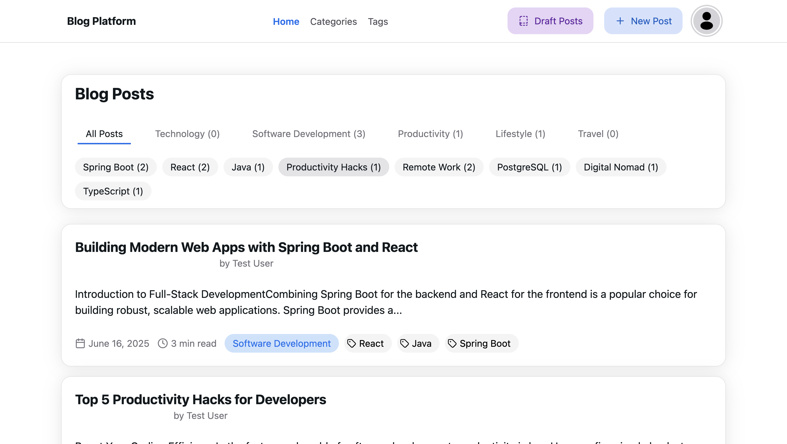
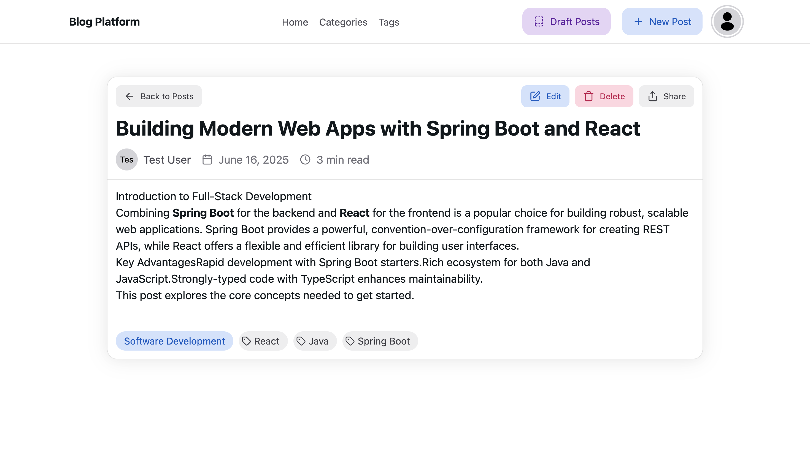
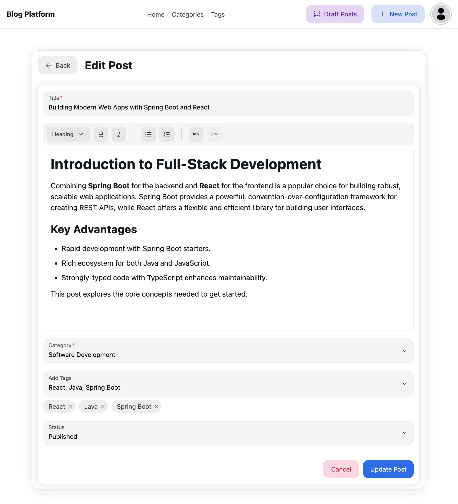
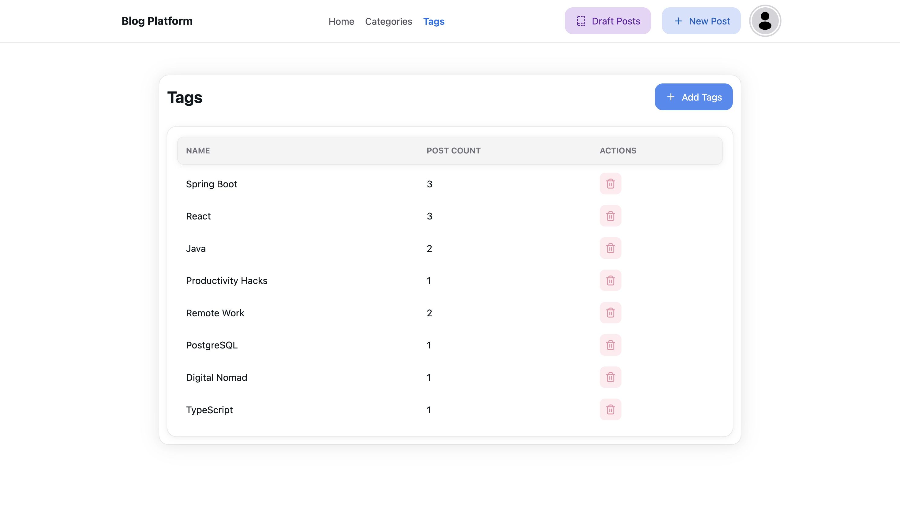
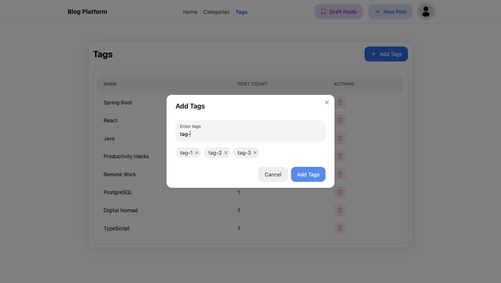
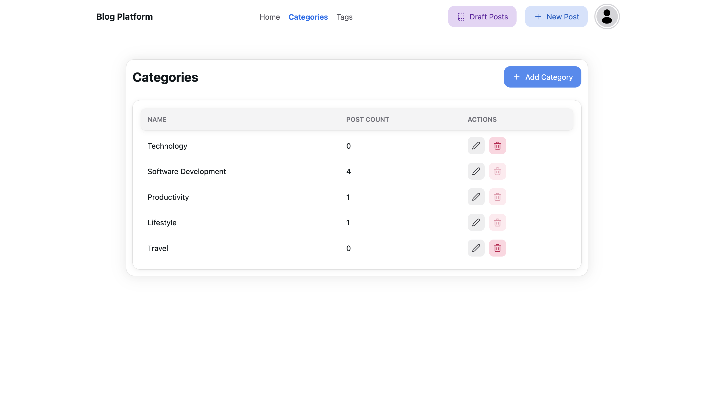

# Blog Platform: A Full-Stack Blogging Application


Blog Platform is a feature-rich, full-stack web application designed for creating and managing a modern blog. It combines a powerful Spring Boot backend with a sleek, responsive React frontend, providing a seamless experience for both authors and readers. Features include JWT-based authentication, a rich text editor, and dynamic content filtering by categories and tags.

## Table of Contents
- [Demo](#demo)
- [Features](#features)
- [Technology Stack](#technology-stack)
- [Project Structure](#project-structure)
- [Setup and Installation](#setup-and-installation)
- [API Endpoints](#api-endpoints)
- [License](#license)

## Demo

Here’s a glimpse of the Blog Platform in action.

**Homepage:** The main screen displaying published posts, with filtering options for categories and tags.


**Post Detail Page:** A clean, readable view of a single blog post, including metadata and author information.


**Create/Edit Post Page:** The authoring interface, featuring a rich text editor powered by Tiptap.


**Categories/Tags Management:** Simple interfaces for administrators to manage the site's taxonomy.


**Categories/Tags Management:** Simple interfaces for adding tags.


**Categories/Tags Management:** Simple interfaces for managing categories.


## Features

- **Post Management:**
  - **Full CRUD Operations:** Create, read, update, and delete posts.
  - **Rich Text Editor:** A modern, Tiptap-based editor for intuitive content creation with support for headings, lists, bold/italic text, and more.
  - **Publishing Workflow:** Save posts as `Draft` or `Published`, with a dedicated page for managing drafts.
  - **Dynamic Filtering:** Filter the main post list by category or tags.
  - **Reading Time:** Automatically calculates and displays the estimated reading time for each post.

- **Authentication & Authorization:**
  - **Secure JWT Authentication:** User login is secured with JSON Web Tokens.
  - **Protected Routes:** Only authenticated users can create, edit, or delete content.
  - **Session Management:** Centralized authentication state managed via React Context.

- **Taxonomy (Categories & Tags):**
  - **CRUD Operations:** Manage categories and tags through dedicated UI pages.
  - **Post Count:** View how many published posts are associated with each category and tag.
  - **Usage Protection:** Prevent deletion of categories or tags that are currently in use by posts.

- **User Experience:**
  - **Modern UI:** A clean and responsive interface built with NextUI and Tailwind CSS.
  - **Seamless Navigation:** Fast client-side routing powered by React Router.
  - **Optimistic UI:** Loading states and feedback provide a smooth user experience.

## Technology Stack

The project is built using a modern, robust technology stack, separated into a backend service and a frontend application.

### Backend (`blogs-be`)
- **Framework:** Spring Boot 3.5.0
- **Language:** Java 21
- **Security:** Spring Security & JSON Web Tokens (JWT)
- **Data Persistence:** Spring Data JPA / Hibernate
- **Database:**
  - **Production/Development:** PostgreSQL
  - **Testing:** H2 In-Memory Database
- **API:** RESTful API with Spring Web
- **Tooling:** Maven, MapStruct (for DTO mapping), Lombok

### Frontend (`blogs-fe`)
- **Library:** React 18 with TypeScript
- **Build Tool:** Vite
- **UI:** NextUI & Tailwind CSS
- **Routing:** React Router
- **State Management:** React Context API
- **HTTP Client:** Axios
- **Rich Text Editor:** Tiptap
- **Icons:** Lucide React

## Project Structure

The repository is organized into two main directories: `blogs-be` for the backend and `blogs-fe` for the frontend.

```
.
├── blogs-be/                 # Spring Boot Backend
│   ├── pom.xml
│   └── src/
│       └── main/
│           ├── java/com/prp/blogs_be/
│           │   ├── controllers/    # API Controllers
│           │   ├── domain/         # DTOs, Entities, Enums
│           │   ├── mappers/        # MapStruct DTO-Entity Mappers
│           │   ├── repositories/   # Spring Data JPA Repositories
│           │   ├── security/       # JWT Filter, UserDetails
│           │   └── services/       # Business Logic
│           └── resources/
│               └── application.properties
│
└── blogs-fe/                 # React Frontend
    ├── package.json
    ├── vite.config.ts        # Vite configuration with API proxy
    └── src/
        ├── components/       # Reusable React Components (PostForm, NavBar, etc.)
        ├── pages/            # Page-level components
        ├── services/         # API service layer (apiService.ts)
        ├── App.tsx           # Main application router
        ├── AuthContext.tsx   # Global authentication state
        └── main.tsx          # Application entry point
```

## Setup and Installation

Follow these steps to get the application running on your local machine.

### Prerequisites
- Java JDK 21
- Apache Maven
- Node.js (v18 or later) & npm
- A running PostgreSQL instance

### 1. Backend Setup (`blogs-be`)

1.  **Configure Database and JWT Secret:**
    - Navigate to `blogs-be/src/main/resources/application.properties`.
    - Create a database in your PostgreSQL instance (e.g., `postgres`).
    - Update the `spring.datasource.*` properties to match your configuration.
    - Set a strong, unique `jwt.secret`. It must be at least 256 bits (32 bytes) long.

    ```properties
    # Database Connection
    spring.datasource.url=jdbc:postgresql://localhost:5432/your_db_name
    spring.datasource.username=your_postgres_user
    spring.datasource.password=your_postgres_password

    # JWT Secret
    jwt.secret=your-super-strong-and-long-secret-key-goes-here-and-nowhere-else
    ```

2.  **Run the Backend:**
    - Open a terminal in the `blogs-be` directory.
    - Run the application using Maven:
      ```bash
      mvn spring-boot:run
      ```
    - The backend server will start on `http://localhost:8080`. A default user (`user@test.com` / `password`) is created on startup.

### 2. Frontend Setup (`blogs-fe`)

1.  **Configure API Proxy:**
    - To avoid CORS issues during development, the frontend proxies API requests to the backend.
    - Create a file named `vite.config.ts` in the `blogs-fe` directory.
    - Add the following configuration:

    ```typescript
    // blogs-fe/vite.config.ts
    import { defineConfig } from 'vite'
    import react from '@vitejs/plugin-react'

    // https://vitejs.dev/config/
    export default defineConfig({
      plugins: [react()],
      server: {
        proxy: {
          '/api': {
            target: 'http://localhost:8080', // Spring Boot backend URL
            changeOrigin: true,
            secure: false,
          },
        },
      },
    })
    ```

2.  **Install Dependencies and Run:**
    - Open a separate terminal in the `blogs-fe` directory.
    - Install the required npm packages:
      ```bash
      npm install
      ```
    - Start the development server:
      ```bash
      npm run dev
      ```
    - The frontend application will be available at `http://localhost:5173` (or another port if 5173 is in use).

You can now access the Blog Platform in your browser!

## API Endpoints

The backend provides the following RESTful API endpoints under the `/api/v1` prefix.

### Authentication
| Method | Path             | Description            |
| :----- | :--------------- | :--------------------- |
| `POST` | `/auth/login`    | Authenticate a user and return a JWT. |

### Posts
| Method | Path             | Description            |
| :----- | :--------------- | :--------------------- |
| `GET`  | `/posts`         | Get all published posts. Can be filtered by `categoryId` or `tagId`. |
| `GET`  | `/posts/drafts`  | Get all draft posts for the authenticated user. |
| `POST` | `/posts`         | Create a new post. (Authenticated) |
| `GET`  | `/posts/{id}`    | Get a single post by its ID. |
| `PUT`  | `/posts/{id}`    | Update an existing post. (Authenticated) |
| `DELETE`| `/posts/{id}`    | Delete a post. (Authenticated) |

### Categories
| Method | Path             | Description            |
| :----- | :--------------- | :--------------------- |
| `GET`  | `/categories`    | Get all categories with their post counts. |
| `POST` | `/categories`    | Create a new category. (Authenticated) |
| `DELETE`| `/categories/{id}` | Delete a category. (Authenticated) |

### Tags
| Method | Path             | Description            |
| :----- | :--------------- | :--------------------- |
| `GET`  | `/tags`          | Get all tags with their post counts. |
| `POST` | `/tags`          | Create one or more new tags. (Authenticated) |
| `DELETE`| `/tags/{id}`     | Delete a tag. (Authenticated) |


## License

This work is licensed under the **Creative Commons Attribution-NonCommercial-ShareAlike 4.0 International License**.

You are free to:
- **Share** — copy and redistribute the material in any medium or format
- **Adapt** — remix, transform, and build upon the material

Under the following terms:
- **Attribution** — You must give appropriate credit to Devtiro, provide a link to the license, and indicate if changes were made. You may do so in any reasonable manner, but not in any way that suggests the licensor endorses you or your use.
- **NonCommercial** — You may not use the material for commercial purposes.
- **ShareAlike** — If you remix, transform, or build upon the material, you must distribute your contributions under the same license as the original.

**Attribution Requirement:**
"Build a Blog Platform App by Devtiro is licensed under CC BY-NC-SA 4.0. Original content available at https://www.youtube.com/@devtiro and https://www.devtiro.com."

To view a copy of this license, visit [https://creativecommons.org/licenses/by-nc-sa/4.0/](https://creativecommons.org/licenses/by-nc-sa/4.0/)